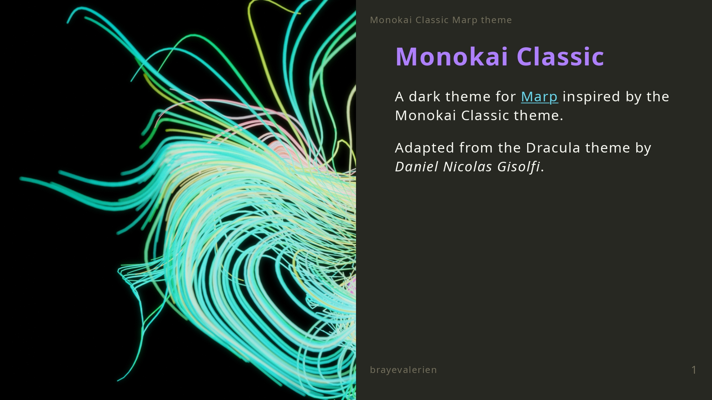

# Monokai Classic for Marp
A [Marp](https://marp.app/) adaptation of the [Monokai Classic theme](https://gist.github.com/brayevalerien/cb94ac685ebc186f359deae113b6710c). This theme supports many features, the [demo document](./demo.md) shows the basics of how to use them.

Thanks to [Daniel Nicolas Gisolfi](https://github.com/dgisolfi) for the Dracula Marp theme this is built upon.

## Installation and usage
### Using the Marp CLI
If you are directly using the [Marp CLI](https://github.com/marp-team/marp-cli) to compile your documents, follow these steps:
1. Download [monokai.css](./monokai.css) and place it wherever you want (*e.g.* `./monokai.css`)
2. Add `theme: monokai` to the frontmatter of your document
3. Use the `--theme` option to compile: `marp my_document.md --theme ./monokai.css --pdf`

### Using the VS-Code extension
If you are using the [VS-Code Marp extension](https://marketplace.visualstudio.com/items?itemName=marp-team.marp-vscode), follow these steps:
1. Download [monokai.css](./monokai.css) and add it to your presentation directory.
2. Add `theme: monokai` to the frontmatter of your document
2. In VS-Code, set the `"markdown.marp.themes"` to `["./monokai.css"]` (or add it to the array if you already have themes installed)